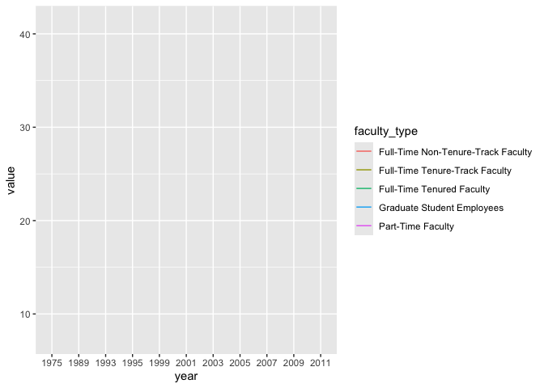
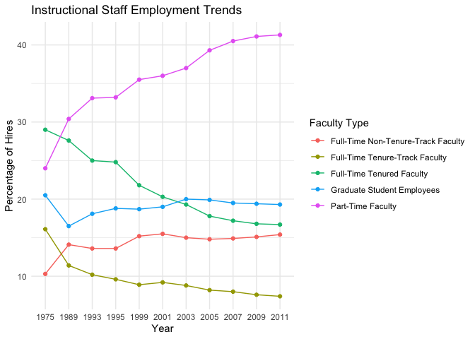
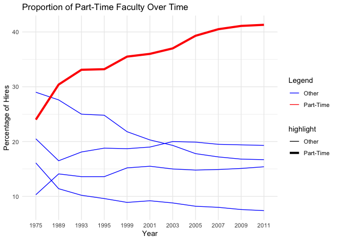

Lab 06 - Ugly charts and Simpson’s paradox
================
Shatavia Bellmon
3/2/26

### Load packages and data

``` r
library(tidyverse) 
library(dsbox)
library(mosaicData) 
```

``` r
staff <- read_csv("data/instructional-staff.csv")
```

    ## Rows: 5 Columns: 12
    ## ── Column specification ────────────────────────────────────────────────────────
    ## Delimiter: ","
    ## chr  (1): faculty_type
    ## dbl (11): 1975, 1989, 1993, 1995, 1999, 2001, 2003, 2005, 2007, 2009, 2011
    ## 
    ## ℹ Use `spec()` to retrieve the full column specification for this data.
    ## ℹ Specify the column types or set `show_col_types = FALSE` to quiet this message.

``` r
staff_long <- staff %>%
  pivot_longer(cols = -faculty_type, names_to = "year") %>%
  mutate(value = as.numeric(value))
```

``` r
staff_long %>% head()
```

    ## # A tibble: 6 × 3
    ##   faculty_type              year  value
    ##   <chr>                     <chr> <dbl>
    ## 1 Full-Time Tenured Faculty 1975   29  
    ## 2 Full-Time Tenured Faculty 1989   27.6
    ## 3 Full-Time Tenured Faculty 1993   25  
    ## 4 Full-Time Tenured Faculty 1995   24.8
    ## 5 Full-Time Tenured Faculty 1999   21.8
    ## 6 Full-Time Tenured Faculty 2001   20.3

``` r
staff_long %>%
  ggplot(aes(x = year, y = value, color = faculty_type)) +
  geom_line()
```

    ## `geom_line()`: Each group consists of only one observation.
    ## ℹ Do you need to adjust the group aesthetic?

<!-- -->

### Exercise 1

``` r
ggplot(staff_long, aes(x = year, y = value, group = faculty_type, color = faculty_type)) +
  geom_line() +
  geom_point() +
  labs(
    title = "Instructional Staff Employment Trends",
    x = "Year",
    y = "Percentage of Hires",
    color = "Faculty Type"
  ) +
  theme_minimal()
```

<!-- -->

### Exercise 2

``` r
staff_long <- staff_long %>%
  mutate(highlight = if_else(faculty_type == "Part-Time Faculty", "Part-Time", "Other"))
```

``` r
ggplot(staff_long, aes(x = year, y = value, group = faculty_type, color = highlight)) +
  geom_line(aes(size = highlight)) +
  scale_color_manual(values = c("Part-Time" = "red", "Other" = "blue")) +
  scale_size_manual(values = c("Part-Time" = 1.5, "Other" = 0.5)) +
  labs(
    title = "Proportion of Part-Time Faculty Over Time",
    x = "Year",
    y = "Percentage of Hires",
    color = "Legend"
  ) +
  theme_minimal()
```

    ## Warning: Using `size` aesthetic for lines was deprecated in ggplot2 3.4.0.
    ## ℹ Please use `linewidth` instead.
    ## This warning is displayed once every 8 hours.
    ## Call `lifecycle::last_lifecycle_warnings()` to see where this warning was
    ## generated.

<!-- -->

# I would have reshaped the data from wide to long format. I would also choose a line graph because it shows continuity and trends over time better than the other plot used. I would also add different colors to the different lines to ensure that differentiation across trends was easy to see.

# In the updated plot, I created a new variable to “highlight” the part-time faculty category in a bold color red, while putting the other faculty types in blue. I also increased the line thickness for the part-time category. This makes sure all lines are seen clearly, allowing the viewer to immediately see the different trends.

### Exercise 3

``` r
fisheries <- read_csv("data/fisheries.csv")
```

    ## Rows: 216 Columns: 4
    ## ── Column specification ────────────────────────────────────────────────────────
    ## Delimiter: ","
    ## chr (1): country
    ## dbl (3): capture, aquaculture, total
    ## 
    ## ℹ Use `spec()` to retrieve the full column specification for this data.
    ## ℹ Specify the column types or set `show_col_types = FALSE` to quiet this message.

# I would replace the pie charts with faceted bar charts to make the data easier to read.

# I would flip the chart as well just because there are lot of countries represented. Each piece of data should be seen clearly.

# Another suggestion could be grouping the countries by continents to look at regional trends.
